# Smart Research Web Scraper

**Developed by Dr Merwan Roudane** · <merwanroudane920@gmail.com> · <https://github.com/merwanroudane>

[](https://webscrapapp.streamlit.app/)


### ▶ Use it now: **<https://webscrapapp.streamlit.app/>**

No installation, no account, no API key. Open the link, click **Try the built-in
demo**, and you have a dataset in about a minute.

Turn web pages into analysis-ready research datasets — without writing code.

A Streamlit application for researchers, economists and analysts who need data
from the web but do not want to learn HTML, CSS selectors, XPath, APIs or
browser automation. Paste a URL, and the app analyses the source, proposes the
datasets it found, previews them, extracts them, cleans and validates them, and
exports both the data and everything needed to reproduce and cite it.

> **New here? Read the [step-by-step user guide](docs/USER_GUIDE.md)** — every
> screen explained, with screenshots, for readers who have never scraped a page.

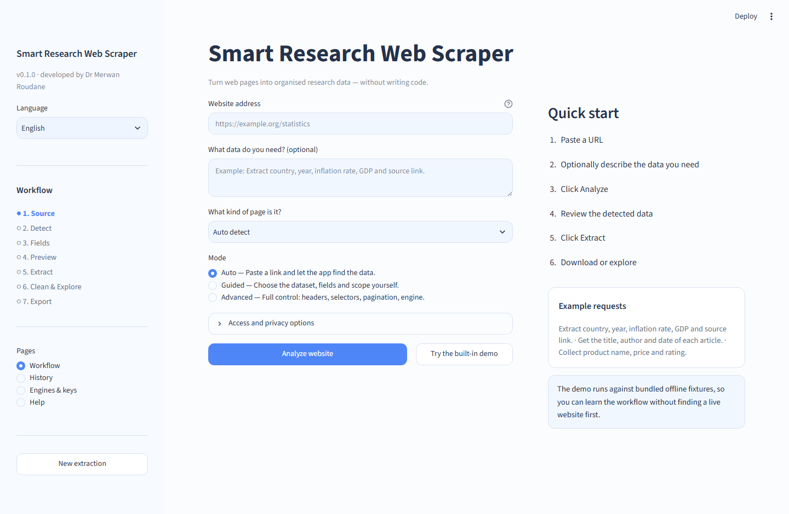

*Paste a link, optionally say what you need, press Analyze. That is the whole
requirement in Auto mode.*

---

## See it in action

<table>
<tr>
<td width="50%">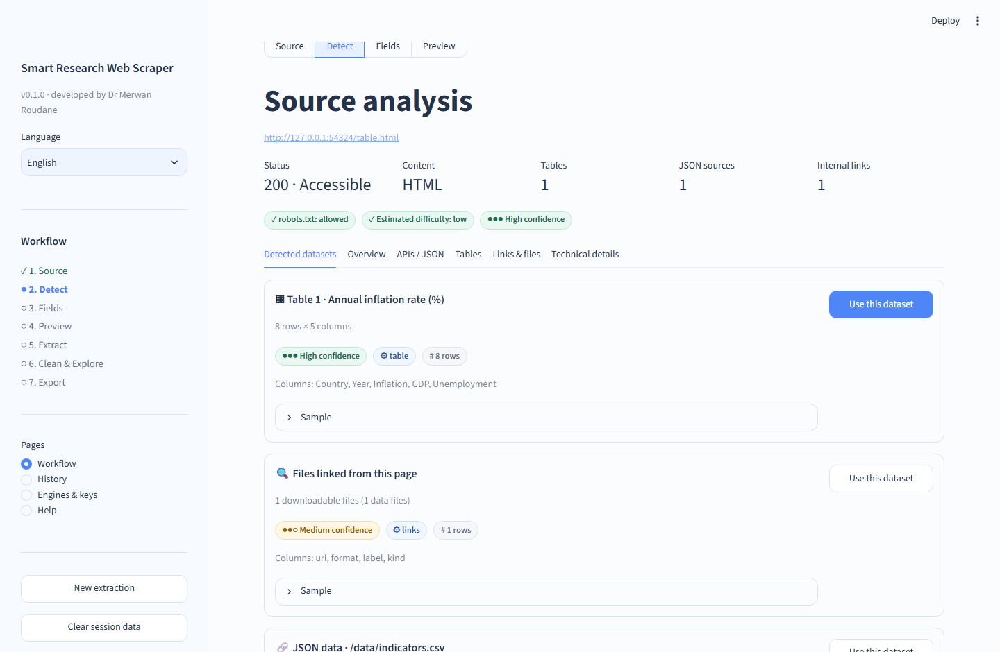</td>
<td width="50%">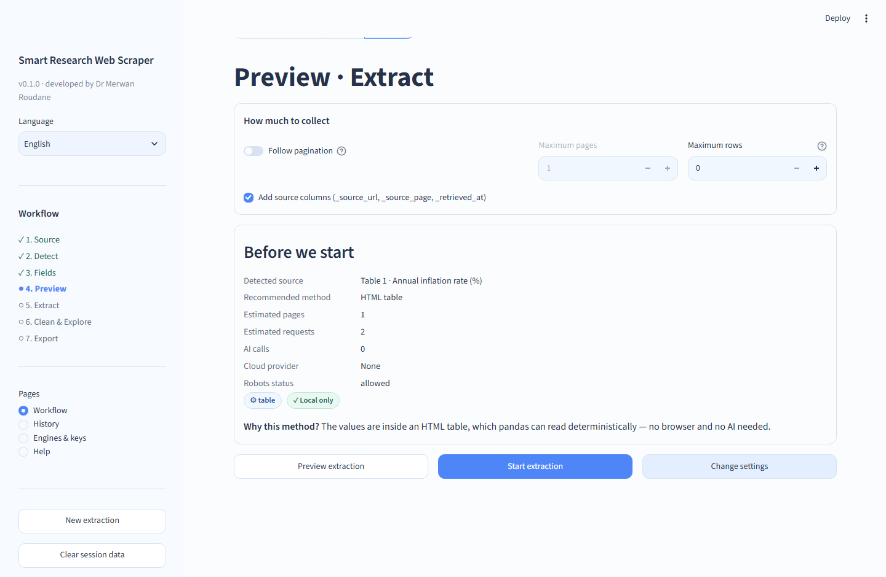</td>
</tr>
<tr>
<td><b>1 · It tells you what it found</b><br>Datasets detected on the page, each with a sample, a confidence badge and the reason it was proposed — plus robots.txt status and estimated difficulty.</td>
<td><b>2 · It tells you what it will do</b><br>Before any run: the method chosen, pages and requests estimated, <code>AI calls 0</code>, <code>Cloud provider None</code>, and a one-line explanation of why this method.</td>
</tr>
<tr>
<td>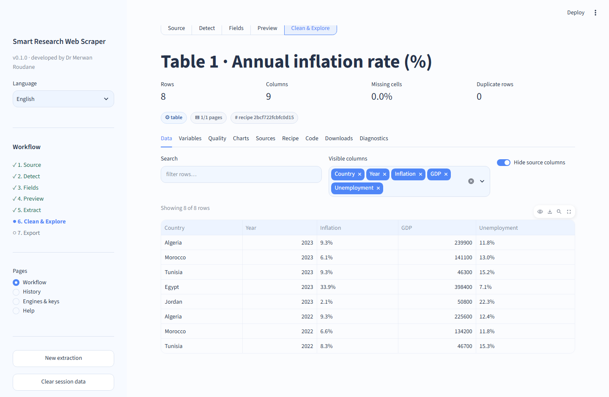</td>
<td>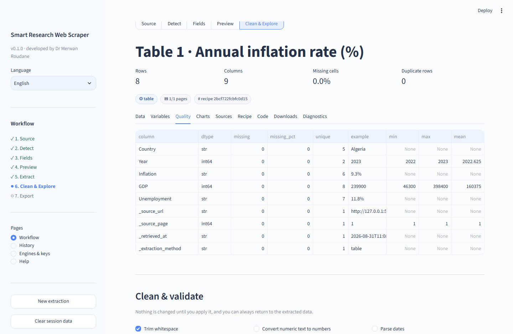</td>
</tr>
<tr>
<td><b>3 · You get a real dataset</b><br>Rows, columns, missing cells and duplicates at a glance, then a searchable table with a column chooser and optional row-level source columns.</td>
<td><b>4 · You clean it on your terms</b><br>Every operation is opt-in and reversible, conversion failures are counted rather than hidden, and outliers are flagged — never deleted.</td>
</tr>
<tr>
<td>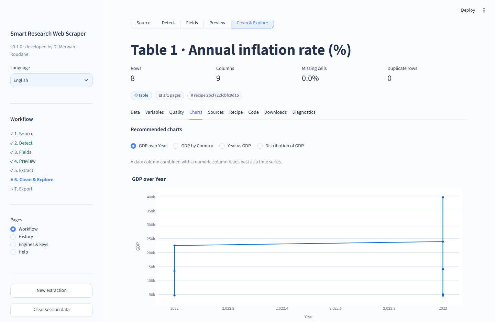</td>
<td>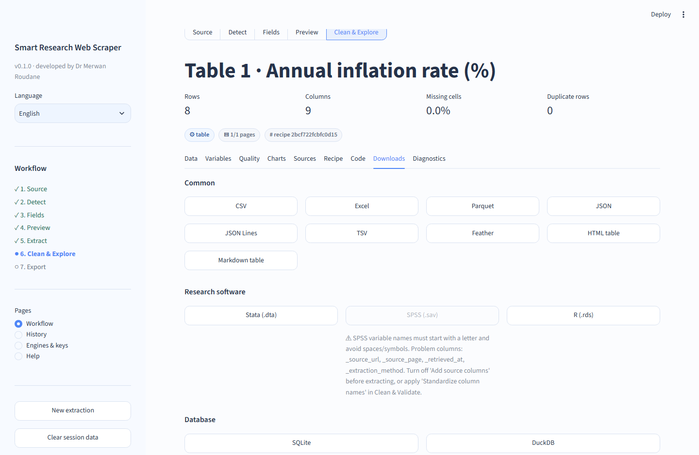</td>
</tr>
<tr>
<td><b>5 · It suggests the right charts</b><br>Recommendations based on your column types, each with a reason, plus a simple builder for anything else.</td>
<td><b>6 · It exports for your workflow</b><br>CSV, Excel, Parquet, Stata, SPSS, R, SQLite, DuckDB and more — a format is only offered when it can represent your data safely.</td>
</tr>
</table>

More screens — sources and provenance, the generated reproducer script — are
shown in the [user guide](docs/USER_GUIDE.md).

---

## New in v0.2

<table>
<tr>
<td width="50%">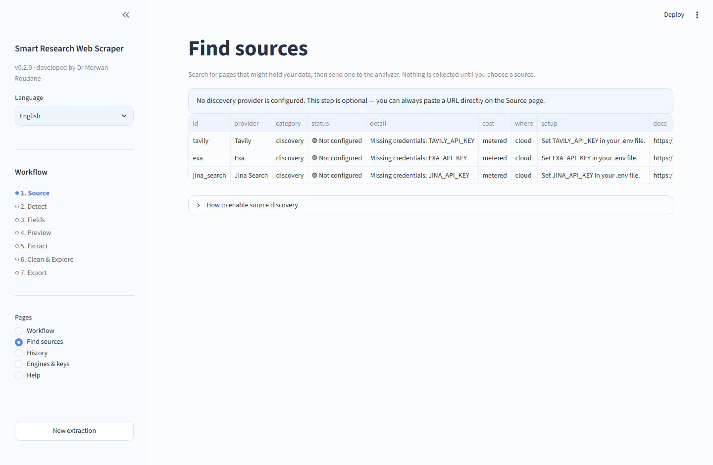</td>
<td width="50%">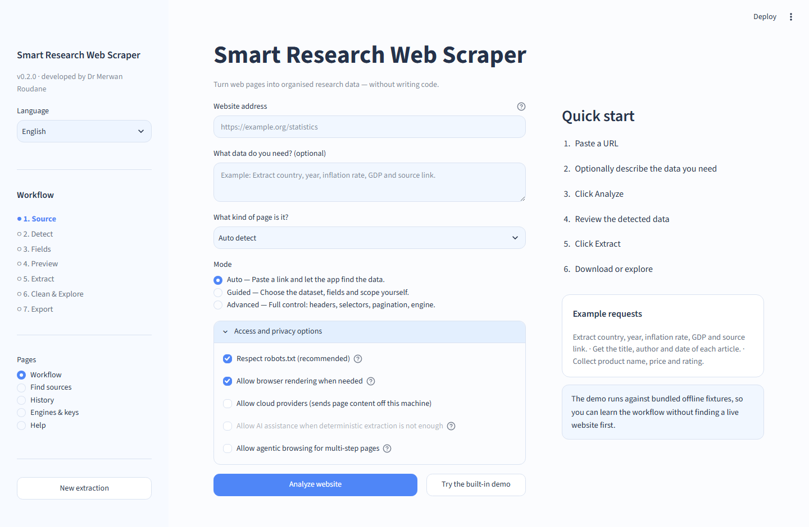</td>
</tr>
<tr>
<td><b>Find sources</b><br>No URL yet? Search for candidate pages with Tavily, Exa or Jina, review the cards, and send one to the analyzer. Discovery never starts a crawl by itself — you approve the source.</td>
<td><b>AI, strictly optional</b><br>Off by default and greyed out until you configure a provider. When enabled it only fills gaps deterministic parsing left, and every value it proposes must appear in the page or the whole proposal is rejected.</td>
</tr>
<tr>
<td>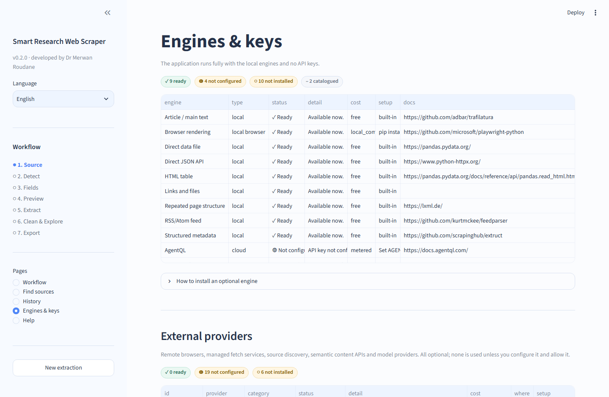</td>
<td>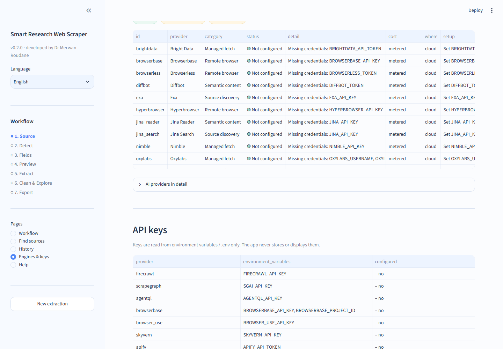</td>
</tr>
<tr>
<td><b>25 engines, four honest states</b><br><code>✓ Ready</code>, <code>◍ Not configured</code>, <code>○ Not installed</code>, <code>– Catalogue</code>. Nine are ready with no key and no optional package; nothing claims to work unless it does.</td>
<td><b>25 external providers</b><br>Remote browsers, ten managed fetch services, source discovery, semantic content and model providers — each showing the exact variable it needs, its cost mode and its docs.</td>
</tr>
</table>

Also in v0.2: Scrapy/Crawlee crawlers, Scrapling adaptive parsing, Crawl4AI
semantic mode, Firecrawl on the v2 SDK, agentic engines behind an explicit
opt-in, CI on Linux and Windows, a reproducible `uv.lock`, and 138 tests.

---

## What makes it research-grade

| | |
| --- | --- |
| **Deterministic before AI** | A published CSV, a JSON endpoint or an HTML table is read directly with pandas/httpx. No LLM is used to parse a table a parser can read. |
| **Provenance for every run** | Source URL, retrieval time, engine, pages, robots status, recipe hash — written to `provenance.json` and optional row-level `_source_url` / `_source_page` / `_retrieved_at` columns. |
| **Reproducible** | Every successful run produces an `extraction_recipe.json/yaml` and a standalone `generated_scraper.py` that matches the engine actually used. |
| **Honest failure** | Extraction failures surface as typed, human-readable errors with next steps. The app never returns an empty frame as if it were a success, and never fabricates data. |
| **Safe by default** | Every URL and every redirect passes an SSRF guard; robots.txt is respected; credentials never reach logs, recipes, provenance or generated code. |

---

## Quick start

### Option A — use the hosted app

<https://webscrapapp.streamlit.app/> — nothing to install. Best for trying the
tool, teaching, or a quick one-off dataset.

### Option B — run it locally

Recommended for real research work: your data stays on your machine, runs are
saved in `runs/`, and you can add the optional browser engine for
JavaScript-heavy sites.

```bash
git clone https://github.com/merwanroudane/webscrap.git
cd webscrap
python -m venv .venv && .venv\Scripts\activate      # Windows
pip install -r requirements.txt
streamlit run app.py
```

The app opens at <http://localhost:8501>. Click **Try the built-in demo** — it
runs against bundled offline fixtures, so you can learn the whole workflow
without finding a live website first.

With `uv` (recommended — it installs Python 3.12 for you):

```bash
git clone https://github.com/merwanroudane/webscrap.git
cd webscrap
uv venv --python 3.12
uv pip install -r requirements.txt
uv run streamlit run app.py
```

### Prerequisites

* Python 3.12 or 3.13 (3.12 is the primary target and what CI runs first).
* No API keys. The complete local core works with zero credentials.

---

## Optional extras

Everything below is optional. Missing packages or keys never break the app —
they appear in **Settings → Engines & keys** with their exact state and install
command. Install a group with `pip install -e ".[group]"`.

| Group | What it adds |
| --- | --- |
| `browser` | Playwright rendering, network API discovery, Selenium fallback |
| `crawler` | Scrapy and Crawlee for bounded multi-page crawls |
| `modern` | Crawl4AI and Scrapling — local adaptive engines |
| `ai` | Anthropic / OpenAI / Google / LiteLLM + Instructor |
| `cloud` | Firecrawl, ScrapeGraphAI, AgentQL |
| `agents` | Stagehand, Browser Use, Skyvern |
| `documents` | PyMuPDF (AGPL-3.0) and Docling (MIT) |
| `helpers` | rapidfuzz, dateparser, ftfy, tldextract, sitemap parsing |
| `research` | kaleido, pytablewriter, pyreadr (AGPL-3.0) |
| `all-local` | Every free, local, permissively licensed extra at once |

```bash
pip install -e ".[browser]" && playwright install chromium   # most useful first
pip install -e ".[all-local]"                                # everything local and free
```

API keys live in `.env` — copy `.env.example` and fill in only what you intend
to use. Keys are read from the environment; the app never stores or shows them.

---

## How it works

```text
URL
 ↓ URL security guard (SSRF) + robots.txt check
 ↓ Source profiler
 ↓ Candidate datasets (table / API / repeated blocks / article / file / feed / links)
 ↓ Field selection + preview
 ↓ Router → cheapest reliable engine
 ↓ Extraction with pagination + stop conditions
 ↓ Cleaning (opt-in, reversible) + validation + quality report
 ↓ Charts, crawl graph, data dictionary, provenance
 ↓ CSV / XLSX / Parquet / JSON / JSONL / TSV / Feather / Stata / SPSS / RDS / SQLite / DuckDB / HTML / Markdown + research bundle
```

### Source types covered

Direct data files (CSV, TSV, JSON, JSONL, XML, Excel, Parquet, Feather, ZIP,
Stata, SPSS) · REST/JSON APIs with page, offset and cursor pagination · HTML
tables · repeated DOM structures (cards, listings, search results) · JSON-LD,
microdata, RDFa, OpenGraph · embedded application state (`__NEXT_DATA__`,
`window.__NUXT__`, hydration JSON) · article/main text · RSS/Atom feeds ·
JavaScript-rendered pages · linked documents (PDF) · sitemaps.

### Engine routing

The router scores every available engine on source fit, determinism,
reliability, speed, cost and your preferences, then picks the cheapest reliable
one and records a short rationale you can audit in **Diagnostics**.

Preference order: downloadable file → documented public API → observed public
JSON endpoint → embedded JSON / JSON-LD → HTML table → deterministic selectors →
static crawler → local browser → remote browser (if configured) →
adaptive/semantic engine → managed provider (if configured) → agentic workflow.
A higher tier is never used because it is newer or fancier.

| Engine | Type | Cost | Needs |
| --- | --- | --- | --- |
| Direct data file | local | free | built in |
| Direct JSON API | local | free | built in |
| HTML table | local | free | built in |
| Repeated page structure | local | free | built in |
| Structured metadata | local | free | built in |
| RSS/Atom feed | local | free | built in |
| Links and files | local | free | built in |
| Article / main text | local | free | built in |
| Scrapy / Crawlee crawler | local | free | `crawler` extra |
| Browser rendering (Playwright) | local browser | local compute | `browser` extra |
| Selenium | local browser | local compute | `browser` extra |
| Scrapling (adaptive) | local | local compute | `modern` extra |
| Crawl4AI | local | local compute | `modern` extra |
| Document (PDF) | local | local compute | `documents` extra |
| Firecrawl | cloud | metered | `cloud` extra + key |
| ScrapeGraphAI | cloud | metered | `cloud` extra + key |
| AgentQL | cloud | metered | key only (REST) |
| Managed fetch × 10 | cloud | metered | key only |
| Semantic content × 2 | cloud | metered | key only |
| Stagehand / Browser Use / Skyvern | agentic | metered | `agents` extra + key |

**Managed fetch providers** — ZenRows, ScrapingBee, ScraperAPI, ScrapingAnt,
Scrapfly, Oxylabs, Bright Data, Scrapeless, Nimble, Thordata. One contract, one
HTTP implementation; each fetches the page and the ordinary deterministic
parsers read it, so results have the same shape as a local run.

**Remote browsers** — Browserbase, Hyperbrowser, Steel, Browserless. The
Playwright workflow connects to a hosted session over CDP instead of launching
local Chromium; no browser logic is duplicated per vendor.

**Source discovery** — Tavily, Exa, Jina Search, plus Firecrawl search. A
separate *Find sources* page: search, review the cards, then approve one source
for analysis. Discovery never starts a crawl by itself.

**Semantic content** — Diffbot and Jina Reader, for prose-heavy pages only.

**AI layer** — provider-independent, off by default. Deterministic parsing is
always tried first; a model may propose field names, map leftover fields, or
extract records only when you enable it. Every reply is schema-validated, and
**every extracted cell is checked against the page** with type-aware matching
(`9.3%`, `0.093` and `9,3 %` count as the same value). An unsupported cell is
blanked rather than shown as data, and a record with nothing left is dropped —
so an invented value cannot become a row.

Two providers are catalogued rather than implemented, each with a documented
reason: **Apify** (actor-specific input schemas make a generic adapter
misleading) and **Zyte API** (fully overlapped by the managed fetch providers).

---

## A five-minute walkthrough

The bundled demo needs no internet and always behaves the same way.

1. **Start** — `streamlit run app.py`, then click **Try the built-in demo**.
2. **Analyze** — the source analysis page reports `200 · Accessible`, `HTML`,
   `Tables: 1`, `robots.txt: allowed`, `Estimated difficulty: low`, and proposes
   `Table 1 · Annual inflation rate (%)` with a *High confidence* badge and a
   sample you can expand.

   
3. **Fields** — click **Use this dataset**. Tick the columns you want, rename
   any of them, and press **Preview extraction**.

   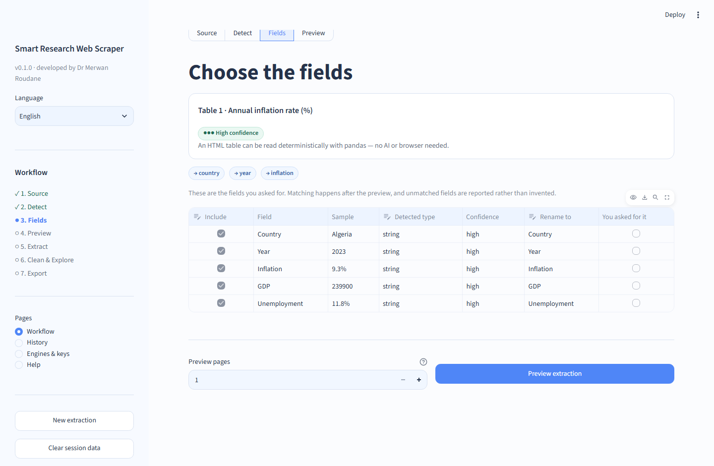
4. **Preflight** — before anything large runs you see the scope in plain
   language:

   ```text
   Detected source     Table 1 · Annual inflation rate (%)
   Recommended method  HTML table
   Estimated pages     1
   Estimated requests  2
   AI calls            0
   Cloud provider      None
   Robots status       allowed
   Why this method?    The values are inside an HTML table, which pandas can
                       read deterministically — no browser and no AI needed.
   ```

5. **Extract** — the run monitor shows progress per page, then the result
   workspace opens on the **Data** tab.

   
6. **Clean** — in **Quality**, tick *Convert numeric text to numbers* and
   *Parse percentages*, then **Apply cleaning**. `9.3%` becomes `0.093`, and the
   operations table reports how many cells changed and how many values failed to
   convert. **Reset to extracted data** always returns to the raw extraction.
7. **Explore and export** — **Charts** suggests sensible plots, **Downloads**
   offers every format your environment supports, and the research ZIP contains
   the dataset, dictionary, provenance, recipe and reproducer script.

More walkthroughs: [`examples/static_table.md`](examples/static_table.md),
[`examples/json_api.md`](examples/json_api.md),
[`examples/dynamic_site.md`](examples/dynamic_site.md), plus real recipe files in
[`examples/recipes/`](examples/recipes).

---

## The result workspace

Nine stable tabs, the same for every dataset:

| Tab | What it holds |
| --- | --- |
| **Data** | Interactive table with search, column chooser and a toggle to hide source columns. |
| **Variables** | The data dictionary: label, dtype, example, missing %, unique count, and whether the name is source-native, heuristic, user-defined or AI-inferred. |
| **Quality** | Missingness, duplicates, constant and high-cardinality columns, conversion failures, schema drift, validation — plus the cleaning panel. |
| **Charts** | Recommended charts first, then a simple builder (type, X, Y, colour, aggregation). |
| **Sources** | Every URL collected, retrieval time, engine, robots status, the crawl graph and a ready-to-paste citation. |
| **Recipe** | Readable summary first, raw YAML in an expander, download buttons. |
| **Code** | The generated reproducer for the engine that actually ran. |
| **Downloads** | Formats grouped Common / Research software / Database / Reproducible, plus the research ZIP. |
| **Diagnostics** | Selected engine, alternatives considered, fallback chain, timings and the sanitized technical log. |

---

## Modes

* **Auto** (default) — URL, an optional plain-language request, and Analyze.
* **Guided** — choose the dataset, fields, scope and cleaning yourself.
* **Advanced** — HTTP method, headers, authorisation, CSS/XPath, JSONPath,
  wait selector, pagination internals, rate limits and engine preference. Every
  setting has a safe default and a short explanation.

Both English and Arabic are supported. Explanatory Arabic text is right-to-left;
URLs, code, selectors and data tables stay left-to-right.

---

## Security and responsible use

* **SSRF guard** — only `http`/`https`; localhost, loopback, private, link-local,
  multicast, reserved and cloud-metadata addresses are refused; DNS results are
  validated; every redirect hop is re-checked; redirects are bounded.
* **robots.txt** — fetched, displayed and respected by default. Disabling it is
  an explicit Advanced choice for sources you are authorised to collect.
* **No access-control bypass** — the app does not solve CAPTCHAs, defeat bot
  challenges or work around logins and paywalls. When a challenge is detected it
  says so and suggests an official API instead.
* **Prompt-injection defence** — page text is always data. It is wrapped as
  untrusted content, never treated as instructions, and secrets are never sent
  alongside it.
* **Secret hygiene** — Authorization headers, cookies, tokens and key-like query
  parameters are redacted from logs and stripped from recipes, provenance files
  and generated code, which use environment variables instead.

You remain responsible for the terms of use, licence, database rights and
privacy rules of any source you collect from, and for citing the original
publisher.

---

## Outputs

**Data** — CSV, Excel, Parquet, JSON, JSON Lines, TSV, Feather, Stata `.dta`,
SPSS `.sav`, R `.rds`, SQLite, DuckDB, HTML, Markdown. A format is offered only
when your environment can produce it *and* the current dataset can be
represented in it; otherwise you see the limitation instead of a corrupt file.

**Research package (ZIP)** — clean dataset, raw dataset, data dictionary,
`provenance.json`, `extraction_recipe.json` + `.yaml`, `generated_scraper.py`,
`quality_summary.csv`, `README_reproduction.md` and `CITATION.txt`.

---

## Project layout

```text
app.py                     Streamlit entry point
src/scraper_app/
  config.py                All limits, palette, provider keys — no magic constants
  models.py                Pydantic models (request, profile, result, provenance…)
  exceptions.py            Typed error taxonomy with bilingual guidance
  service.py               Orchestration used by the UI and the tests
  ai/                      provider-independent LLM layer + structured output
  providers/               remote browsers, managed fetch, discovery,
                           semantic content, documents, registry
  security/                url_guard, robots, secrets, content_safety
  discovery/               profiler, tables, repeated patterns, APIs, pagination,
                           structured data, sitemap, Playwright network probe
  routing/                 capability_registry, scoring, router
  engines/                 http_client + direct_file, json, table, html, article,
                           document, playwright, selenium, scrapy, crawlee,
                           scrapling, crawl4ai, firecrawl, scrapegraph, agentql,
                           managed fetch, semantic content, agentic
  extraction/              schema_builder, field_mapper, dedupe, normalizer
  data/                    cleaner, validator, profiler, dictionary, provenance
  export/                  exporters with per-format capability checks
  visualize/               charts, crawl graph
  reproducibility/         recipe, code generator, report/bundle generator
  storage/                 run store (Parquet artifacts + history)
  ui/                      home, source analysis, dataset builder, run, workspace,
                           cleaning, settings, history, help, i18n, theme
tests/                     unit + integration + offline fixture site
docs/                      architecture, engines, security, deployment
```

---

## Verified behaviour

The acceptance scenarios below run in CI-friendly tests against
a bundled fixture server on `127.0.0.1` — no live website, no flakiness:

| Scenario | Test |
| --- | --- |
| A · static HTML table → dataset | `test_scenario_a_static_table_to_dataset` |
| B · repeated cards + `rel=next` pagination | `test_scenario_b_repeated_cards_with_pagination` |
| C · JS page → observed JSON API → HTTPX | `test_scenario_c_js_page_switches_to_observed_json_api` |
| C2 · API pagination stops on an empty page | `test_json_api_pagination_stops_on_empty_page` |
| D · direct CSV download | `test_direct_csv_file_is_downloaded` |
| E · natural-language fields mapped to real columns | `test_scenario_e_natural_language_fields_are_mapped` |
| F · dictionary, provenance, recipe, script, bundle | `test_scenario_f_research_artifacts_are_produced` |
| G · blocked/missing sources fail with typed errors | `test_scenario_g_failures_are_typed_and_safe` |

Plus unit coverage for the SSRF guard (schemes, private ranges, metadata hosts,
userinfo, ports, redirects), robots handling, secret redaction, prompt-injection
detection, all detectors, every pagination style, export round-trips (read each
file back and compare), recipe round-trips, generated-code compilation and
router policy.

```bash
pytest -q          # 138 passed
ruff check .       # All checks passed!
```

---

## Development

```bash
uv pip install pytest pytest-asyncio respx responses ruff
pytest -q
ruff check .
```

The test suite runs entirely against a bundled fixture server on `127.0.0.1`,
so it never depends on a live website. The end-to-end acceptance scenarios live
in `tests/integration/test_end_to_end.py`.

### Documentation

| Document | For |
| --- | --- |
| [User guide](docs/USER_GUIDE.md) | Researchers — every screen, step by step, with screenshots |
| [Architecture](docs/architecture.md) | How the code is organised and how a request flows |
| [Engines](docs/engines.md) | Routing order, scoring, pagination, adding an engine |
| [Security](docs/security.md) | SSRF guard, robots, prompt injection, secret hygiene |
| [Deployment](docs/deployment.md) | Docker, servers, configuration, retention |
| [examples/](examples) | Worked walkthroughs and real recipe files |

---

## Troubleshooting

| Symptom | What to do |
| --- | --- |
| *This address points to a private or internal network* | Expected: only public addresses are fetched. Use a public URL, or the bundled demo. |
| *robots.txt asks automated tools not to read this path* | Look for an official API or dataset download, or ask the site owner. |
| *This page builds its content with JavaScript* | Enable browser rendering (Access and privacy options) after installing Playwright + Chromium. |
| *No structured dataset was detected* | Describe the fields you need, try Guided mode, or try article/document extraction. |
| SPSS export unavailable | SPSS variable names must start with a letter — turn off source columns, or apply *Standardize column names*. |
| Browser mode says Chromium is not installed | `playwright install chromium` |

---

## Licence

This project is released under the **MIT Licence** — see [LICENSE](LICENSE).

```text
Copyright (c) 2026 Merwan Roudane
```

You may use, modify, distribute and sell it, including commercially, provided
the copyright notice and permission notice are kept. It comes with no warranty.

### The software, not the data

The MIT licence covers **this application only**. Data you collect with it stays
subject to the source website's terms of use, copyright, database rights,
licence and any applicable privacy law. Check those before redistributing a
dataset, and cite the original publisher — the tool is the instrument, not the
source.

### Third-party licences

Every required dependency is MIT, BSD or Apache-2.0, so the default installation
is fully compatible with MIT. The full inventory, including which optional
packages carry copyleft terms and why they are not installed by default, is in
[THIRD_PARTY_LICENSES.md](THIRD_PARTY_LICENSES.md).

Two optional packages are **AGPL-3.0** and therefore opt-in: `pyreadr` (R `.rds`
export) and `pymupdf` (PDF extraction). The app works without them and says so
clearly; installing either brings AGPL obligations into your own deployment.

---

## Author and citation

Developed by **Dr Merwan Roudane** — <merwanroudane920@gmail.com> —
<https://github.com/merwanroudane>.

If this tool contributed to a publication, please cite the original data
publisher first, and mention the tool as:

> Roudane, M. (2026). *Smart Research Web Scraper* (Version 0.2.0) [Computer software].
> https://github.com/merwanroudane/webscrap
