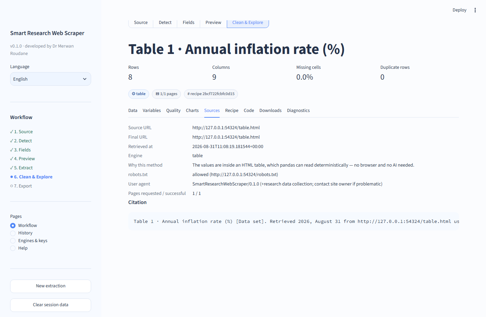
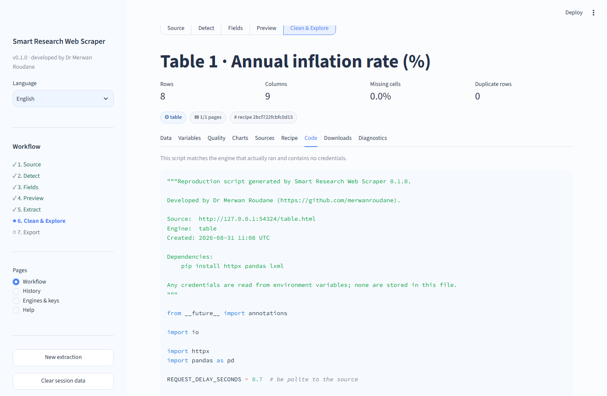
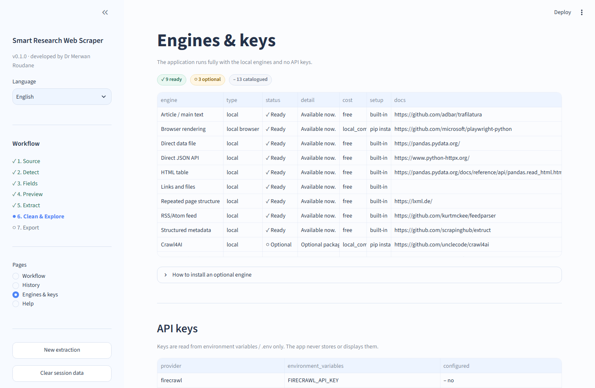

# User guide — Smart Research Web Scraper

A complete, step-by-step guide for researchers. It assumes **no knowledge** of
HTML, CSS selectors, XPath, APIs or web scraping. If you can copy a link from
your browser, you can use this application.

Developed by **Dr Merwan Roudane** · <https://github.com/merwanroudane>

---

## Table of contents

1. [Install and start](#1-install-and-start)
2. [The screen at a glance](#2-the-screen-at-a-glance)
3. [Step 1 — Source: give it a link](#3-step-1--source-give-it-a-link)
4. [Step 2 — Detect: read what was found](#4-step-2--detect-read-what-was-found)
5. [Step 3 — Fields: choose your columns](#5-step-3--fields-choose-your-columns)
6. [Step 4 — Preview and preflight](#6-step-4--preview-and-preflight)
7. [Step 5 — Extract](#7-step-5--extract)
8. [Step 6 — Clean, check and explore](#8-step-6--clean-check-and-explore)
9. [Step 7 — Export and cite](#9-step-7--export-and-cite)
10. [Collecting many pages](#10-collecting-many-pages)
11. [Reproducing a dataset later](#11-reproducing-a-dataset-later)
12. [Guided and Advanced modes](#12-guided-and-advanced-modes)
13. [Working in Arabic](#13-working-in-arabic)
14. [Engines and API keys](#14-engines-and-api-keys)
15. [When something goes wrong](#15-when-something-goes-wrong)
16. [Responsible use](#16-responsible-use)
17. [FAQ](#17-faq)

---

## 1. Install and start

### The quickest start: use the hosted app

**<https://webscrapapp.streamlit.app/>**

Nothing to install and no account needed. Everything in this guide applies to it,
with two differences: browser rendering and PDF extraction are unavailable
there, and your runs are not kept between visits — download what you need before
you close the tab.

For regular research work, install it locally instead: your data stays on your
machine, run history is preserved, and every engine is available.

### Install locally

You need Python 3.11 or newer (3.12 recommended). Open a terminal and run:

```bash
git clone https://github.com/merwanroudane/webscrap.git
cd webscrap
python -m venv .venv
.venv\Scripts\activate          # Windows
# source .venv/bin/activate     # macOS / Linux
pip install -r requirements.txt
```

### Start

```bash
streamlit run app.py
```

Your browser opens at <http://localhost:8501>. To stop the app, press
`Ctrl + C` in the terminal.

### Do I need an API key?

**No.** Everything in this guide works with zero keys and zero paid services.
Keys are only needed for optional cloud engines you will probably never need.

### Optional: browser rendering

Some modern sites build their content with JavaScript. To handle those, install
the optional browser once:

```bash
pip install playwright
playwright install chromium
```

---

## 2. The screen at a glance


| Area | What it does |
| --- | --- |
| **Left sidebar — Language** | Switches the whole interface between English and العربية. |
| **Left sidebar — Workflow** | Your position in the seven steps. `✓` done · `●` current · `○` not started · `!` needs review. |
| **Left sidebar — Pages** | Workflow (the main flow), History, Engines & keys, Help. |
| **Left sidebar — New extraction** | Clears everything and starts again. |
| **Main area** | Whatever the current step needs — never more than a handful of controls. |
| **Right column** | Quick start reminder and example requests. |

**The golden rule:** in Auto mode you only ever need the address box and the
blue button. Everything technical is hidden until you ask for it.

### Try it without a website

Click **Try the built-in demo**. The app starts a small offline server with
bundled example pages, so you can practise the entire workflow with no
internet and no risk. Every screenshot in this guide comes from that demo.

---

## 3. Step 1 — Source: give it a link

| Control | What to put in it |
| --- | --- |
| **Website address** | The page that *shows* the data you want. Copy it from your browser's address bar. `https://` is added if you forget it. |
| **What data do you need?** (optional) | Plain language, e.g. `Extract country, year, inflation rate, GDP and source link`. English or Arabic both work. |
| **What kind of page is it?** | Leave on **Auto detect** unless you already know (Table, Listings, Article, API, Document…). This is only a hint, never a hard rule. |
| **Mode** | Leave on **Auto**. See [section 12](#12-guided-and-advanced-modes) for the others. |
| **Access and privacy options** | Three checkboxes, explained below. |

### The access and privacy options

* **Respect robots.txt (recommended)** — on by default. `robots.txt` is the file
  where a website states which paths automated tools should leave alone. Only
  turn this off for a source you are authorised to collect.
* **Allow browser rendering when needed** — on by default. It runs a local
  browser *only* when the data is not in the plain page, and nothing leaves your
  computer.
* **Allow cloud providers** — off by default. Turning it on permits sending page
  content to an external paid service. You will be told before any such run.

Then click **Analyze website**. Analysis is read-only: it fetches the page,
inspects it, and shows you what it found. Nothing is downloaded in bulk yet.

**Tip — pick the right page.** Give the app the page that displays the table or
the list, not the site's home page. A search-results page or a statistics page
works far better than a landing page.

---

## 4. Step 2 — Detect: read what was found


### The metrics row

| Metric | Meaning |
| --- | --- |
| **Status** | The HTTP response. `200 · Accessible` is good. |
| **Content** | `HTML`, `HTML + JS` (needs a browser), or the file type. |
| **Tables** | How many HTML tables were found. |
| **JSON sources** | Data endpoints found — these are usually the best source. |
| **Internal links** | How many links point elsewhere on the same site. |

### The badges

* `✓ robots.txt: allowed` — collection from this path is permitted by the site's
  own rules. `⚠ restricted` means it is not; `? unknown` means no answer.
* `✓ Estimated difficulty: low` — a straightforward source.
* `●●● High confidence` — how sure the app is about what it found.

Status is never shown by colour alone: there is always a symbol and a word.

### Detected datasets

Each card is one thing the app can give you:

```text
▦ Table 1 · Annual inflation rate (%)
8 rows × 5 columns
●●● High confidence   ⚙ table   # 8 rows
Columns: Country, Year, Inflation, GDP, Unemployment
> Sample                                    [ Use this dataset ]
```

Expand **Sample** to see real rows before committing. Cards are sorted best
first, so the top one is usually right. Click **Use this dataset** on the one
you want.

### The other tabs

* **Overview** — final URL, page title, recommended method, and *why JavaScript
  may be needed* when relevant.
* **APIs / JSON** — every data endpoint found, with its fields and record count.
* **Tables** — every table with its size and title.
* **Links & files** — downloadable CSV/Excel/PDF files linked from the page.
* **Technical details** — the raw profile. Collapsed by default; you never need it.

**Tip — prefer a JSON card over a table card** when both appear. It is faster,
more stable and easier to reproduce.

---

## 5. Step 3 — Fields: choose your columns


A table of everything the dataset offers:

| Column | What to do with it |
| --- | --- |
| **Include** | Untick anything you do not want. |
| **Field** | The name as the source publishes it. Read-only. |
| **Sample** | A real value, so you can tell what the field actually holds. |
| **Detected type** | string / number / integer / date / url / boolean. Change it if wrong. |
| **Confidence** | How reliable that field is. |
| **Rename to** | Type your own column name — useful for Stata/SPSS friendly names. |
| **You asked for it** | Ticked when the field matches your plain-language request. |

If you typed a request in step 1, the fields you asked for appear as chips above
the table. Fields that cannot be matched are reported honestly later — the app
never invents a column to satisfy a request.

Set **Preview pages** (1 is fine) and click **Preview extraction**.

---

## 6. Step 4 — Preview and preflight


### How much to collect

* **Follow pagination** — off means this page only. On means keep going to the
  next page (see [section 10](#10-collecting-many-pages)).
* **Maximum pages / Maximum rows** — your safety limits. `0` rows means no extra
  limit beyond the built-in cap.
* **Add source columns** — adds `_source_url`, `_source_page`, `_retrieved_at`
  and `_extraction_method` to every row. Keep this on for research: it is how a
  reader knows where each observation came from. You can hide the columns in the
  table view, and they are always in the provenance file regardless.

### Before we start

This card tells you exactly what is about to happen, in plain language:

| Line | Why it matters |
| --- | --- |
| **Detected source** | Which dataset will be collected. |
| **Recommended method** | The engine chosen. |
| **Estimated pages / requests** | How much traffic the site will receive. |
| **AI calls** | `0` means no language model is involved. |
| **Cloud provider** | `None` means nothing leaves your machine. |
| **Robots status** | The access signal at this moment. |
| **✓ Local only** badge | Confirms no metered service will be billed. |
| **Why this method?** | A short, auditable reason — e.g. *the values are inside an HTML table, which pandas can read deterministically — no browser and no AI needed*. |

Three buttons: **Preview extraction** (a small sample first), **Start
extraction** (the real run), **Change settings** (go back).

**Always preview before a large run.** The preview shows the first rows and the
field mapping, so mistakes cost seconds instead of thousands of requests.

---

## 7. Step 5 — Extract

A live status panel shows the current page, the number of pages done, rows
collected and any warnings. Long runs report progress page by page.

When it finishes, the result workspace opens automatically:


The four metrics at the top — Rows, Columns, Missing cells, Duplicate rows — are
your first sanity check. Under them, badges show the engine used, how many pages
succeeded, and the recipe hash that identifies this exact extraction.

**The Data tab** gives you search, a visible-columns chooser, and a toggle to
hide the source columns while you read.

---

## 8. Step 6 — Clean, check and explore

### The Quality tab


The top table profiles every column: dtype, missing count and percentage, unique
values, an example, and min/max/mean for numbers. Warnings appear above it for
duplicates, constant columns, conversion failures and schema drift.

### Clean & validate

Nothing changes until you press **Apply cleaning**, and **Reset to extracted
data** always brings back the original.

| Option | What it does | When to use it |
| --- | --- | --- |
| **Trim whitespace** | Collapses stray spaces and line breaks. | Almost always (on by default). |
| **Normalize missing tokens** | Turns `-`, `N/A`, `..`, `—` into proper missing values. | Almost always (on by default). |
| **Convert numeric text to numbers** | `239900` text → number; handles `1,234.56` and `1.234,56`. | Before any statistics. |
| **Parse percentages** | `9.3%` → `0.093`. | When your source prints percent signs. |
| **Parse currency amounts** | `$1,200` → `1200`. | Prices and financial values. |
| **Parse dates** | Text dates → real dates. | Before any time series work. |
| **Normalize yes/no columns** | `Yes`/`No`/`1`/`0`/`نعم`/`لا` → true/false. | Binary indicators. |
| **Remove duplicate rows** | Drops exact repeats. Off by default. | Only when you are sure repeats are errors. |
| **Standardize column names** | `Annual Rate (%)` → `annual_rate`. | Before exporting to Stata/SPSS/R. |
| **Advanced → Flag outliers** | Adds a `*_outlier_flag` column. **Never deletes rows.** | Screening, not filtering. |

Two promises worth knowing:

* Values that fail to convert are **counted and reported**, never silently turned
  into missing data. A `Conversion failures` table appears when it happens.
* If more than half the values in a column are not numeric, the column is left as
  text and you get a warning instead of a ruined column.

After applying, an **Applied operations** table records what changed and how many
cells were affected — this goes into your provenance file automatically.

### Validation

If you described the fields you needed, the app checks them: required fields
that are empty, values that are not valid numbers/dates/URLs, ranges and
uniqueness. Validation is **advisory** — it reports, it never deletes.

### The Charts tab


**Recommended charts** come first, chosen from your column types, each with a
one-line reason. Below, **Build your own chart** gives you type, X, Y, colour and
aggregation. Under **Automatic summaries** you get numeric describe() statistics
and the most frequent categories.

### The Variables tab

Your data dictionary: label, dtype, example, missing %, unique count, and — a
detail that matters for research integrity — **name_source**, telling you whether
each column name came from the source itself, a heuristic, you, or AI.

### The Sources tab



Every URL collected, the retrieval time, the engine, the robots status, the crawl
graph when several pages were visited, and a ready-to-paste citation line.

---

## 9. Step 7 — Export and cite


Formats are grouped and each is checked against your data **before** the button
appears:

| Group | Formats | Notes |
| --- | --- | --- |
| **Common** | CSV, Excel, Parquet, JSON, JSON Lines, TSV, Feather, HTML, Markdown | CSV opens anywhere; Parquet is best for large data. |
| **Research software** | Stata `.dta`, SPSS `.sav`, R `.rds` | Needs clean variable names — see the tip below. |
| **Database** | SQLite, DuckDB | For querying with SQL. |
| **Reproducible** | data dictionary, provenance (JSON/CSV), reproducer script | The research paperwork. |

A greyed-out button always explains itself, for example:

```text
SPSS (.sav)  ⚠ SPSS variable names must start with a letter and avoid
             spaces/symbols. Problem columns: _source_url. Turn off
             'Add source columns' before extracting, or apply
             'Standardize column names' in Clean & Validate.
```

That is deliberate: you get a clear limitation instead of a corrupt file.

**Tip for Stata/SPSS/R users:** tick **Standardize column names** in Clean &
Validate first. It makes every name lower-case, underscore-separated and legal.

### The research package

**Download the complete research package (ZIP)** gives you everything at once:

```text
dataset_clean.csv          the analysis-ready data
dataset_raw.csv            exactly what was extracted, before cleaning
data_dictionary.csv        variable documentation
provenance.json            full run manifest
extraction_recipe.json     machine-readable description of the extraction
extraction_recipe.yaml     the same, human-readable
generated_scraper.py       a standalone script that reproduces the dataset
quality_summary.csv        per-column quality metrics
README_reproduction.md     how to reproduce it, in prose
CITATION.txt               a citation line for the dataset
```

Attach this to your paper's replication package and a reader can verify your
data collection completely.

---

## 10. Collecting many pages

1. On the Preview step, turn on **Follow pagination**.
2. Set **Maximum pages** — start small (2 or 3) and confirm the result.
3. Check the preflight card: *Estimated requests* tells you the load you are
   about to place on the source.
4. Press **Start extraction**.

The app detects the pagination style itself: numbered pages (`?page=2`),
offset/limit, API cursors, `Next` links, `Next` buttons, `Load more` buttons and
infinite scroll. It stops automatically when a page is empty, the next link is
missing, a page repeats, your limits are reached, or an error occurs — and it
tells you which.

Every collected page is recorded in `_source_page`, so you can always trace a row
back to its page.

**Be polite.** The default is roughly 1–2 requests per second. In Advanced mode
you can lower it further. Speed is never the goal; a stable source and an
undisturbed publisher are.

---

## 11. Reproducing a dataset later

### The Recipe tab

A readable summary of exactly how the data was collected — source, engine,
pagination, limits, fields. Download it as JSON or YAML. **Recipes never contain
passwords, cookies or tokens**, so they are safe to share with a co-author or
attach to a paper.

### The Code tab



A complete, standalone Python script that matches the engine that actually ran:
an API route produces `httpx` code, a table route produces
`httpx + pandas.read_html`, a browser route produces a Playwright script. It
includes the rate limit, the pagination loop and the export, and it never
contains credentials.

Run it anywhere:

```bash
pip install httpx pandas lxml
python generated_scraper.py
```

### Re-running from History

The **History** page lists every past run with its date, source, engine, row
count and recipe hash. Select one and choose:

* **Load dataset** — reopen the stored data.
* **Re-run recipe** — collect it again from the live source (to refresh data, or
  to check whether the source changed).
* **Delete run** — remove it from disk.

You can also upload an `extraction_recipe.json` someone sent you and run it.

---

## 12. Guided and Advanced modes

| Mode | For whom | What appears |
| --- | --- | --- |
| **Auto** (default) | Everyone, always start here | URL, optional request, preset, Analyze. |
| **Guided** | You want to control choices without code | Dataset choice, fields, crawl scope, cleaning, output — all in plain language. |
| **Advanced** | You know what you want technically | Everything below. |

Advanced mode adds four expanders on the Preview step. Every setting has a safe
default and a tooltip; you can open one and ignore the rest.

* **Request** — HTTP method, timeout, extra headers, a bearer token / API key
  (password field, memory only, never written anywhere), and requests per second.
* **Selectors** — CSS selector for repeated items, XPath, JSON records path
  (e.g. `data.items`), and a wait-for element for browser mode.
* **Pagination** — override the detected type, the URL template (`{page}` marks
  the page number), the next/load-more selector, and the API cursor field.
* **Engine** — force a specific engine instead of letting the router choose.

**A word of caution:** the automatic choices are usually better than a manual
override. Use Advanced mode when detection got something wrong, not by default.

---

## 13. Working in Arabic

Choose **العربية** in the sidebar. Labels, help text, error messages and the
workflow stepper switch to Arabic and read right-to-left.

Deliberately **not** flipped: data tables, column names, URLs, selectors and
code. Numeric research data stays left-to-right because forcing it RTL makes it
harder to read, not easier.

Your plain-language request works in Arabic too:

```text
استخرج الدولة، السنة، معدل التضخم، الناتج المحلي، ومصدر البيانات
```

---

## 14. Engines and API keys



The **Engines & keys** page is an honest inventory:

| Status | Meaning |
| --- | --- |
| `✓ Ready` | Installed and usable right now. |
| `○ Optional` | A real adapter exists, but the package or key is missing. The exact install command is shown. |
| `– Catalogue` | A known provider whose adapter is **not implemented** in this version. |

Nothing here pretends to work. The page also lists which environment variables
each provider needs and whether they are configured — never the key values
themselves — plus the limits currently in force (page caps, timeouts, request
rate, user agent).

Install commands are **printed for you to run**; the app never executes shell
commands on your behalf.

---

## 15. When something goes wrong

Errors are always readable, with the next steps listed. Common ones:

| Message | What it means | What to do |
| --- | --- | --- |
| **This address points to a private or internal network** | The link resolves to a local/internal address. | Use a public URL. This protection is deliberate and cannot be bypassed from the UI. |
| **robots.txt asks automated tools not to read this path** | The site declined automated access here. | Look for an official API or data download; contact the publisher; choose another source. |
| **The site refused the request (403)** | The server rejected it. | Try the official API, use another source, or add authorised headers in Advanced mode. |
| **The site asked us to slow down (429)** | You are requesting too fast. | Lower requests per second, reduce pages, retry later. |
| **This page builds its content with JavaScript** | The data is not in the plain HTML. | Install Playwright and enable browser rendering; or check the APIs/JSON tab first. |
| **No structured dataset was detected** | Nothing table-like was recognised. | Describe the fields you need, try Guided mode, or try article/document extraction. |
| **The source requires interactive verification** | A CAPTCHA or bot challenge. | The app does not bypass these. Use an official API or complete it manually if permitted. |
| **This format cannot safely represent the current data** | e.g. illegal SPSS names. | Follow the hint in the message — usually *Standardize column names*. |
| **Optional engine not installed** | A feature needs a package. | Copy the install command from Engines & keys, then restart the app. |

For deeper diagnosis, open the **Diagnostics** tab: selected engine,
alternatives considered, fallback chain, timings and a sanitized technical log.
Raw tracebacks never appear in the interface.

---

## 16. Responsible use

This tool collects **public** data and is built to be a good citizen:

* `robots.txt` is respected by default and its status recorded in every run.
* Requests are rate-limited and retries back off politely.
* Access controls are never circumvented: no CAPTCHA solving, no bot-challenge
  evasion, no login or paywall bypass.
* Page content is treated as data, never as instructions to the software.
* Credentials never reach logs, recipes, provenance files or generated code.

What remains **your** responsibility as a researcher:

* Check the source's terms of use, data licence and database rights before
  collecting at scale or redistributing.
* Respect privacy law when a dataset contains information about people.
* Cite the original publisher — the tool is the instrument, not the source.

---

## 17. FAQ

**Do I need to know how to code?**
No. Auto mode never asks for a selector, a query or a line of code.

**Will it work on any website?**
No tool can. It handles the common research cases very well — tables, listings,
APIs, articles, published files, feeds, PDFs. Sites behind logins, paywalls or
bot challenges are deliberately out of scope.

**Does it use AI?**
Not by default. Every route in this guide is deterministic parsing. AI is an
optional layer for naming fields when you ask for it, and any run that would use
an AI or cloud service says so on the preflight card first.

**Where is my data stored?**
When you run it locally, on your computer under `runs/<run_id>/`. Nothing is
uploaded anywhere unless you explicitly enable a cloud provider. On the hosted
app at <https://webscrapapp.streamlit.app/> the workspace is temporary, so
download your dataset or the research package before leaving the page.

**How large a dataset can it handle?**
Comfortably tens of thousands of rows in the interface. Beyond that, export to
Parquet or DuckDB. Built-in caps protect you from accidentally huge downloads;
they are adjustable via environment variables.

**Can I share my extraction with a colleague?**
Yes — send them the `extraction_recipe.json`, which they load on the History
page, or the `generated_scraper.py`, which runs on its own.

**Is the demo using the internet?**
No. It serves bundled files from your own machine, which is why it always
behaves identically.

---

## Where to go next

* [README](../README.md) — project overview and installation.
* [`examples/static_table.md`](../examples/static_table.md) — table walkthrough.
* [`examples/json_api.md`](../examples/json_api.md) — API walkthrough.
* [`examples/dynamic_site.md`](../examples/dynamic_site.md) — JavaScript pages.
* [`docs/engines.md`](engines.md) — how routing chooses a method.
* [`docs/security.md`](security.md) — the safety model in detail.
* [`docs/architecture.md`](architecture.md) — how the code is organised.
* [`docs/deployment.md`](deployment.md) — Docker and server deployment.
